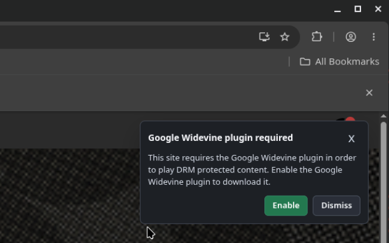

# Chromium Widevine Helper

Chromium Widevine Helper provides a Chromium extension and native messaging
helper for installing Google's Widevine CDM into Chromium-based browser
profiles on Linux.

Widevine is not bundled in this repository. When enabled, the
native helper downloads the official Google Widevine component and installs it
into the active browser profile's `WidevineCdm` directory.

## Repository Layout

- `extension/`: Chromium extension source.
- `helper/`: Native helper script and native messaging host manifest.
- `Packaging/rpm/`: Fedora RPM spec.

## Step 1/3: Install The Helper

The extension cannot install native binaries or register native messaging hosts
by itself. Install the helper first:

Fedora/Derivatives:
```bash
sudo dnf install ./Packaging/rpm/result/noarch/chromium-widevine-helper-1.0.8-1.fc44.noarch.rpm
```

The helper installs:

- `/usr/libexec/chromium-widevine/chromium-widevine`
- `/usr/bin/chromium-widevine`
- Native messaging host manifests for common Chromium-based browsers
- A packaged copy of the extension under `/usr/share/chromium-widevine/extension`

After installing the helper, install the extension from the Chrome Web Store or
load the unpacked `extension/` directory for local install.

## Step 2/3: Install The Extension Locally

1. Open `chrome://extensions`.
2. Enable `Developer mode`.
3. Click `Load unpacked`.
4. Select the `/usr/share/chromium-widevine/extension` directory.

## Step 3/3: Register the extension ID with the browser's native messaging host:

```bash
chromium-widevine --install-native-hosts chromium
```

6. Return to `chrome://extensions` and reload the extension.

The `--install-native-hosts` step is required for unpacked/local install
because Chromium native messaging only allows exact extension IDs. The unpacked
extension ID can differ from the packaged extension ID.

## Install In Chromium-Based Browsers

Install the helper, load or install the extension in the target browser,
then refresh the native messaging host registration for that browser when
needed.

Examples:

```bash
chromium-widevine --install-native-hosts helium
chromium-widevine --install-native-hosts chromium
chromium-widevine --install-native-hosts chrome
chromium-widevine --install-native-hosts brave
chromium-widevine --install-native-hosts edge
chromium-widevine --install-native-hosts vivaldi
chromium-widevine --install-native-hosts opera
chromium-widevine --install-native-hosts thorium
chromium-widevine --install-native-hosts iridium
chromium-widevine --install-native-hosts ungoogled-chromium
```

For a custom user data directory, pass it before the command:

```bash
chromium-widevine --user-data-dir /path/to/profile --install-native-hosts
```

Or pass it as a browser argument:

```bash
chromium-widevine --install-native-hosts chromium --user-data-dir=/path/to/profile
```

## Browser Compatibility

This package supports Chromium extension native messaging. It can support
Chromium-based browsers when they allow Chrome-compatible extensions and use
Chromium-style native messaging host manifests.

The helper installs system native host manifests for common Chromium lookup roots,
including Chromium, Chrome, Edge, Brave, Vivaldi, Opera, Helium, Thorium, and
Iridium paths.

Mullvad Browser and Zen Browser are Firefox-family browsers, not Chromium-based
browsers. Those would require a separate Firefox-compatible extension and native 
messaging host manifest format; adding Chromium native-host files is not enough.

## Chrome Web Store Package

The Chrome Web Store package contains only the extension. Users still need the
native helper installed separately because Chrome extensions cannot install
native programs or system native messaging host manifests.

WIP:
After the Chrome Web Store assigns the final extension ID, we will add that ID to the
native host allowlist shipped by the helper so normal Web Store users do
not need the manual `--install-native-hosts` step.

## Using The Extension

When a known streaming site requests Widevine and the browser cannot provide it,
the extension shows a notice with `Enable` and `Dismiss`.



Clicking `Enable` will:

1. Check whether Widevine is already installed.
2. If missing, require an internet connection.
3. Download the Google Widevine CDM.
4. Install it into the current browser profile.
5. Ask to restart the browser so Chromium loads the plugin.

If Widevine is already installed, enabling updates local state and asks for a
browser restart. If the extension is disabled, the helper will not load
Widevine for that profile.

## Native Helper Commands

Check status:

```bash
chromium-widevine --status
```

Enable or install Widevine:

```bash
chromium-widevine --enable
```

Disable Widevine for the current profile:

```bash
chromium-widevine --disable
```

Force an update check:

```bash
chromium-widevine --update
```

Restart the current browser process:

```bash
chromium-widevine --restart
```

Refresh native messaging host files:

```bash
chromium-widevine --install-native-hosts chromium
```

## Troubleshooting

If the extension says the helper is unavailable, or Enable does not reach the
helper, refresh the native host files:

```bash
chromium-widevine --install-native-hosts chromium
```

Then reload the extension in `chrome://extensions`.

If restart fails, confirm the helper is installed:

Fedora/Derivatives
```bash
rpm -q chromium-widevine-helper
```

If Widevine is missing and there is no internet connection, the extension will
remain disabled until the plugin can be downloaded.

Native helper logs are written under the active browser profile:

```text
WidevineCdm/chromium-widevine-native.log
```

Common profile roots include:

```text
~/.config/chromium
~/.config/google-chrome
~/.config/BraveSoftware/Brave-Browser
~/.config/microsoft-edge
~/.config/vivaldi
~/.config/opera
~/.config/net.imput.helium
```

The exact profile path depends on the browser and `--user-data-dir` setting.

## Architecture Support

The helper supports the Linux Widevine packages Google publishes for:

- `x86_64`
- `aarch64` / `arm64`

Unsupported architectures stay disabled and report that Google does not publish
the Linux Widevine CDM for that architecture.
